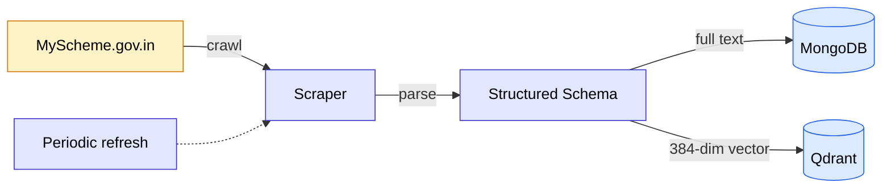
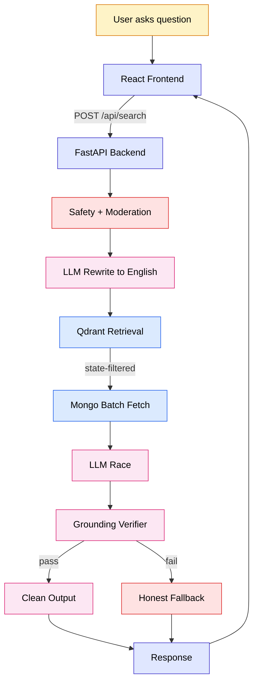
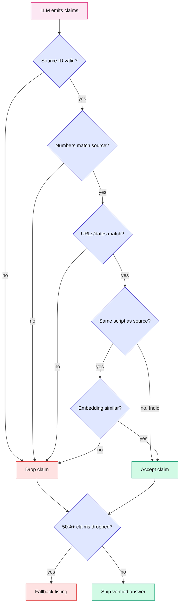

# SahayakSetu — System Diagrams

Three diagrams covering the full product. Designed to be read top-to-bottom by
product, design, and engineering audiences alike.

---

## 1. Ingestion Pipeline

**Source**: 4,600 schemes scraped from India's official `myscheme.gov.in` portal.
**Scraper**: Playwright + HTTP fetcher walking each scheme detail page.
**Schema extracted per scheme**: name, slug, level (central/state), state, eligibility, benefits, documents required, application modes, references.
**Two stores, two purposes**:
- **MongoDB** (`sahayaksetu.schemes`) holds the full document text. This is what the LLM grounds answers in — the source of truth.
- **Qdrant** (`sahayak_schemes`) holds 384-dim vector embeddings (BAAI/bge-small-en-v1.5) plus a lean payload (slug, name, level, state). This is what *finds* relevant schemes via similarity search.
**Periodic refresh**: re-runs the whole pipeline on a schedule, so new government schemes appear in the product without code changes.

---

## 2. User Query Flow

**User**: types or speaks in any of 9 Indian languages. Frontend (React on Vercel) detects UI language and posts to `/api/search`.
**Safety + Moderation**: PII scrubber, prompt-injection guard, query length cap, plus an LLM classifier that blocks abusive or off-topic queries. Runs in parallel with session history fetch from MongoDB.
**LLM Rewrite to English**: a fast cheap LLM call (`gpt-4o-mini`, ~1s) that translates the query to English and resolves pronouns from chat history (`इस स्कीम` → `MGNREGA`). The English query goes to retrieval; the original goes to the answer LLM.
**Qdrant Retrieval**: top-K vector search filtered by user's state (extracted via regex from profile or query) plus all central schemes. Punjab user never sees Gujarat schemes.
**Mongo Batch Fetch**: pulls full document text for the top hits in one round-trip.
**LLM Race**: Gemini 2.0 Flash and DeepSeek v3.2 fire simultaneously. First to respond wins, the loser is cancelled. ~1.1s typical. If one provider is down, the other covers automatically.
**Grounding Verifier**: checks every claim against source documents (see Diagram 3).
**Clean Output**: strips markdown bold and citation markers like `[S1]` that the frontend doesn't render. Logs language mismatches.
**Honest Fallback**: when grounding rejects too many claims, we don't make something up — we show ranked scheme names with an honest "closest matches" framing in the user's language.
**Response payload**: answer text, source cards with apply links, eligibility hints, near-miss schemes, plus debug info (translated query, provider, timing).

Total target latency: ~12s end-to-end.

---

## 3. Grounding & Trust Layer

The LLM emits claims as JSON, each tagged with a `source_id`. Each claim runs through five checks in order:

1. **Source ID valid?** Did the LLM cite a real source from the retrieved set, or invent `[S5]` when only S1–S4 exist?
2. **Numbers match source?** Every digit-string in the claim must appear character-for-character in the source. A claim saying "₹50,000" when the source says "₹1,100" is dropped instantly. **Language-agnostic** — works for Hindi, Tamil, Kannada answers because numbers stay as digits regardless of script.
3. **URLs and dates match?** Same exact-match rule. Catches invented portal URLs and hallucinated deadlines.
4. **Same script as source?** If the claim is in Devanagari/Tamil/Kannada (Indic) and the source is English, we skip the embedding check — the English-tuned embedding model produces noise on cross-lingual pairs. The number/URL/date check above is the strongest grounding signal we can apply across scripts, so we trust that and accept.
5. **Embedding similar?** For same-script claims, cosine similarity ≥ 0.60 between claim and source. Catches subtle paraphrase drift.

**Drop ratio gate**: if more than 50% of claims fail, the whole answer is rejected and we show the honest fallback listing. Otherwise the verified answer ships, with any individually-dropped claim sentences stripped out.

This is the layer that lets us promise "no made-up scheme amounts" — every number in our answer was extracted from an official government source document.

---

## How the diagrams connect

Diagram 1 prepares the data. Diagram 2 uses it to answer questions. Diagram 3 validates the answer before it reaches the user.
